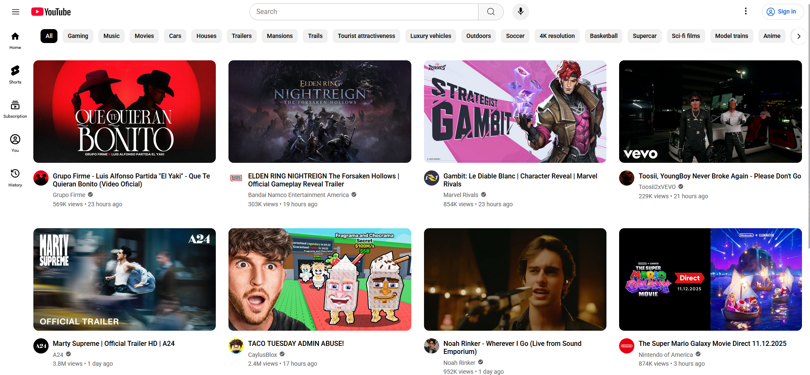
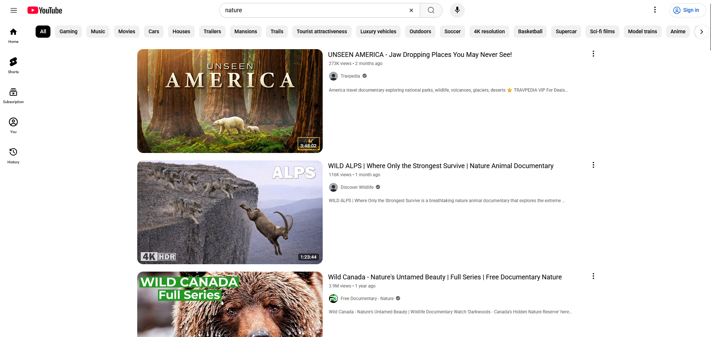

# YouTube Clone

A frontend YouTube clone built with React, featuring a responsive home feed, search with autocomplete, search results with video previews, and a fully responsive sidebar — powered by the YouTube Data API v3.

## Live Demo

[Click here for a Demo](https://youtube-clone-blue-gamma.vercel.app/)

## Screenshots

### Homepage



<br>

### Search results page



## Features

- Home feed displaying trending/popular videos via YouTube Data API
- Infinite scroll with pagination using nextPageToken
- Search bar with debounced autocomplete suggestions via Google's suggest endpoint
- Keyboard navigation support for search suggestions (↑ ↓ Enter Escape)
- Search results page with view counts, publish dates, and channel avatars
- Video preview on hover (embedded autoplay iframe)
- Max-resolution thumbnail upgrade with fallback chain
- Responsive category tab bar with scroll buttons and tooltips
- Collapsible sidebar with overlay mode on smaller screens
- Animated sidebar slide-in using Framer Motion
- Scroll lock when overlay sidebar is open
- Serverless API proxy (Vercel function) to handle CORS and protect API key

## Tech Stack

### Frontend

- React
- Vite
- React Router
- Framer Motion
- react-icons
- he (HTML entity decoding)

### Backend/API

- YouTube Data API v3 (search, channels, videos)
- Google Suggest API (search autocomplete)
- Vercel Serverless Function (CORS proxy)

## Installation

### 1. Clone the repository

```bash
git clone https://github.com/brn-lin/YouTube-Clone.git
cd YouTube-Clone
```

### 2. Install dependencies

```bash
npm install
```

### 3. Set up environment variables

Create a `.env` file in the root directory:

```bash
cp .env.example .env
```

Then fill in the required values:

```env
YOUTUBE_API_KEY=your_youtube_api_key
```

You can obtain a YouTube Data API v3 key from the Google Cloud Console.

### 4. Start the server

```bash
npm run dev
```

### 5. Open the application

http://localhost:5173
